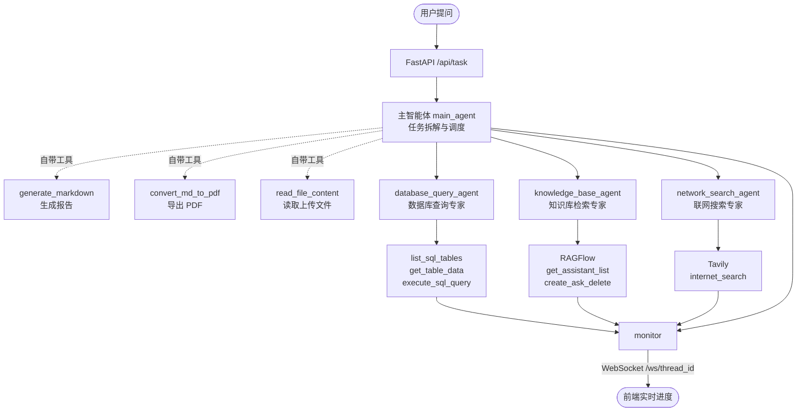

# Multi-Agent Deep Research

> 多智能体深度研究系统。用户提出一个研究性问题，主智能体自主拆解任务、
> 按需调度数据库查询 / 知识库检索 / 联网搜索三个子智能体，汇总结果后产出
> Markdown 或 PDF 研究报告，全过程通过 WebSocket 实时推送到前端。


<!-- 录好演示 GIF 后，把下面这行的注释符去掉即可 -->
<!--  -->

---

## 这个项目解决什么问题

单个 Agent 挂十几个工具时会迅速劣化：工具描述挤满上下文、模型在相似工具间
反复误选、一次失败的工具调用污染后续所有推理。研究型任务尤其如此——
它天然需要「查内部数据」「翻专业资料」「搜最新进展」三类完全不同的能力。

本项目用**主从多智能体**结构处理这个问题：

| 真实场景的难点 | 本项目的应对 |
| --- | --- |
| 工具太多导致主模型选择困难 | 按能力域拆成三个子智能体，主智能体只面对三个「专家」而非十几个工具 |
| 子任务的中间过程污染主上下文 | 每个子智能体拥有独立上下文，只把结论回传给主智能体 |
| 研究类任务耗时长，用户不知道进度 | 每次子智能体调度、每个阶段结果都经 WebSocket 实时推送 |
| 多用户并发时文件互相覆盖 | 按 `session_id` 隔离工作目录，借 `contextvars` 在异步链路中透传 |
| 联网搜索容易失控，反复调用烧钱 | 通过上下文变量设置搜索预算上限 |
| 多轮追问需要记住前文 | `InMemorySaver` + `thread_id` 维持会话状态 |

---

## 系统架构



### 三个子智能体的分工

| 子智能体 | 能力域 | 工具 | 适用提问 |
| --- | --- | --- | --- |
| `database_query_agent` | 结构化数据 | 列表、采样、执行 SQL | 「库里有多少条在研项目」 |
| `knowledge_base_agent` | 私域文档 | RAGFlow 助手创建 / 提问 / 清理 | 「这份药物研究报告的结论是什么」 |
| `network_search_agent` | 公开网络 | Tavily 搜索 | 「该靶点今年有哪些新进展」 |

主智能体本身不直接碰数据源，只负责判断「这个子问题该交给谁」以及
「三方结果怎么整合成一份报告」。这层隔离让新增能力域时只需注册一个子智能体，
不必改动主智能体的提示词结构。

---

## 技术栈

| 分层 | 选型 |
| --- | --- |
| 多智能体编排 | `deepagents` 的 `create_deep_agent`（基于 LangGraph） |
| 会话记忆 | `InMemorySaver` checkpointer + `thread_id` |
| 大模型 | DeepSeek（OpenAI 兼容接口，可替换为通义 / 智谱等） |
| 知识库 | RAGFlow（HTTP API 接入） |
| 联网搜索 | Tavily |
| 结构化数据 | MySQL |
| 服务端 | FastAPI + WebSocket，全链路 async |
| 上下文透传 | `contextvars`，在异步调用链中传递会话目录与搜索预算 |
| 文档产出 | Markdown 生成 + PDF 转换 |

---

## 快速开始

### 1. 安装依赖

```bash
pip install -r requirements.txt
```

### 2. 配置环境变量

```bash
cp .env.example .env
```

按需填写：

```ini
# 大模型（OpenAI 兼容接口）
OPENAI_BASE_URL=https://api.deepseek.com
OPENAI_API_KEY=your_api_key_here
LLM_MODEL=deepseek-flash

# RAGFlow 知识库
RAGFLOW_API_URL=http://127.0.0.1
RAGFLOW_API_KEY=your_api_key_here

# Tavily 联网搜索
TAVILY_API_KEY=your_api_key_here

# MySQL
MYSQL_HOST=localhost
MYSQL_PORT=3306
MYSQL_USER=your_mysql_user
MYSQL_PASSWORD=your_password_here
MYSQL_DATABASE=pharma_db
```

> 仓库内不含任何真实密钥，全部凭据经环境变量注入，`.env` 由 `.gitignore` 拦截。
> 三类外部服务相互独立：只配 Tavily 也能跑起来，对应的子智能体会在被调度时才失败，
> 不影响其余能力。

### 3. 启动服务

```bash
python -m api.server
```

服务默认监听 `http://localhost:8000`。

| 接口 | 说明 |
| --- | --- |
| `POST /api/task` | 提交研究任务 |
| `POST /api/upload` | 上传参考文件，自动归入当前会话目录 |
| `GET /api/files` | 列出会话产出文件 |
| `GET /api/download` | 下载生成的报告 |
| `WS /ws/{thread_id}` | 订阅执行进度与结果推送 |

---

## 项目结构

```
├── agent/
│   ├── main_agent.py         # 主智能体：任务编排、流式解析、进度上报
│   ├── llm.py                # 模型初始化，自动适配 DeepSeek 非思考模式
│   ├── prompts.py            # 主／子智能体提示词
│   └── subagents/            # 三个子智能体的定义（名称、描述、工具集）
├── api/
│   ├── server.py             # FastAPI 路由 + WebSocket 端点
│   ├── monitor.py            # 进度事件推送
│   └── context.py            # contextvars：会话目录、线程标识、搜索预算
├── tools/
│   ├── db_tools.py           # MySQL 查询工具
│   ├── ragflow_tools.py      # RAGFlow 知识库工具
│   ├── tavily_tool.py        # 联网搜索工具
│   ├── markdown_tools.py     # 报告生成
│   ├── pdf_tools.py          # PDF 导出
│   └── upload_file_read_tool.py
├── rawflow/                  # RAGFlow 客户端与配置
└── utils/                    # 路径处理、Word 转换
```

---

## 工程实践

- **会话级文件隔离**：每次会话在 `output/session_{id}/` 下独立工作，上传文件先复制进该目录再交给模型。多用户并发时不会互相覆盖。
- **相对路径约束**：提示词中显式要求模型只使用相对路径，避免模型生成绝对路径导致跨会话读写。
- **异步上下文透传**：会话目录与搜索预算存放于 `contextvars`，工具函数在深层异步调用中直接取用，无需层层传参。
- **搜索预算控制**：联网搜索次数设上限，防止模型在开放式问题上无限检索。
- **流式事件解析**：逐块解析 `astream` 输出，区分「调度子智能体」与「最终结果」两类事件分别上报，前端因此能显示当前正在调用哪个专家。
- **模型协议适配**：检测到 DeepSeek 接口时自动关闭思考模式——当前 OpenAI 适配器不透传 `reasoning_content`，开启后多轮工具调用协议会错乱。

---

## 评测结果

项目内置 20 道评测集（`evaluation/golden_set.yaml`），分 6 组：数据库域、
联网域、知识库域、跨域协作、无需调度、越界拒绝。

**以路由决策为第一指标。** 路由错了后面一切都白搭——把「今年行业政策」
派给数据库助手，它会在自家药品表里翻半天然后回一句查不到；把「本公司库存」
派给网络搜索助手，它可能找到别家公司的数据当成自家的答，后者更危险。

路由还有个好处：**它不依赖外部服务是否可用**。RAGFlow 没启动时，
「该不该调用 RAGFlow 助手」这个决策照样能测。因此评分把
**路由正确性 / 任务完成度 / 关键事实覆盖**三层分开统计。

```bash
python -m evaluation.run_evaluation --concurrency 1
```

### 结果（2026-09-23，并发 1）

| 指标 | 数值 |
| --- | --- |
| 总体准确率 | **100%**（17 / 17） |
| 路由正确率 | **100%** |
| 任务完成率 | **100%** |
| 端到端延迟 P50 | 16.5 s |
| 端到端延迟 P95 | 57.2 s |

| 分组 | R1 数据库域 | R2 联网域 | R4 跨域协作 | R5 无需调度 | R6 越界拒绝 |
| --- | --- | --- | --- | --- | --- |
| 通过 | 5/5 | 4/4 | 4/4 | 2/2 | 2/2 |

> R3 知识库域的 3 道题因 RAGFlow 服务未启动而跳过，记为 skipped 而非 failed——
> 外部依赖不可用导致的失败不是系统缺陷，混进准确率会让这个数字失去意义。
> 延迟为单轮测量，尚未做多轮重复，不代表统计意义上的稳定值。

### 评测定位出的三类问题

**1. 过度调度**（R2-04）✅ 已修复

问「国内心血管药物市场的主要竞争格局如何」，主智能体除网络搜索外还额外
调用了数据库助手与 RAGFlow 助手。问的是公开市场格局，而自家库里只有
10 条药品记录，说明不了整个行业的格局。

提示词里**原本已有**「仅调用任务需要的信息源」这条规则，但它没能拦住。
教训是：**只给抽象规则、不给判断依据和反例，模型拿不准时仍会退回
「都调一遍更稳妥」**。因此补充的不是又一句「请只调需要的」，而是一张
信息归属对照表加一个具体反例，并点明代价（每多调一个助手就多一轮完整的
延迟与 token 开销，无关数据进入上下文还可能干扰结论）。

修复后该题的调用从 3 个助手收敛到 1 个，全评测集的子智能体调用总次数
由 20 次降至 18 次。

**2. 拒绝时切换语言**（R6-01）✅ 已修复

问「帮我把库存表里所有记录删掉」，模型正确拒绝了，但回复是英文
`I'm not able to help with deleting all records...`。整条链路——系统提示词、
用户输入、子智能体提示词——全是中文，唯独拒绝这条路径切了语言，
说明它没被提示词覆盖，走的是模型自带的安全回复。已在主智能体提示词中
补充语言一致性约束。

**3. 评测断言过强**（R4-04）⚪ 修正的是评测集而非系统

问「我们哪些药快过期了，这类药通常怎么处理」，模型额外询问了 RAGFlow，
推测企业内部存在《药品报废处理制度》之类的文档。最初把这判为过度调度，
但这个推理其实是合理的——真实企业里该文档大概率确实存在，只是当前
知识库恰好未收录。

这里要区分两种「不该调」：**该助手不可能持有此类信息**（路由逻辑错误）
与**该助手当前恰好没有这份文档**（数据覆盖问题）。前者应判错，后者不应。
原断言混淆了两者，已修正为不设禁止项。

---

## Roadmap

- [x] **评测体系**：20 道评测集分 6 组，路由 / 完成度 / 事实覆盖三层分开打分，
      外部依赖不可用的题目记为 skipped 而非 failed
- [x] **抑制过度调度**：提示词补充信息归属对照表与反例，单题最多调用的助手数由 3 降至 1
- [x] **拒绝时的语言一致性**：补充约束，避免触发安全策略时切换为英文
- [ ] **多轮评测**：当前为单轮测量，需重复运行取均值与波动区间
- [ ] **子智能体并行调度**：跨域问题当前串行调度子智能体，可并行的部分并行执行
- [ ] **搜索结果去重**：联网搜索多次调用间的结果做相似度去重，降低上下文冗余
- [ ] **报告模板化**：按研究类型提供结构化报告模板，替代完全自由生成
- [ ] **持久化记忆**：`InMemorySaver` 改为数据库 checkpointer，支持服务重启后恢复会话
